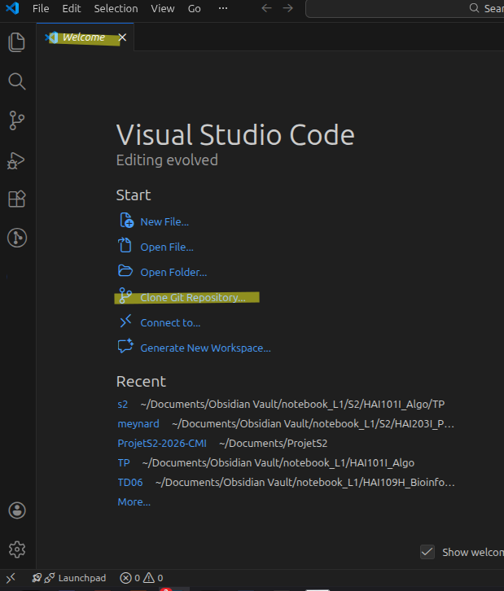
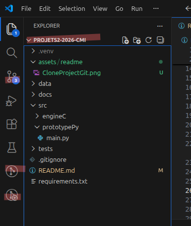
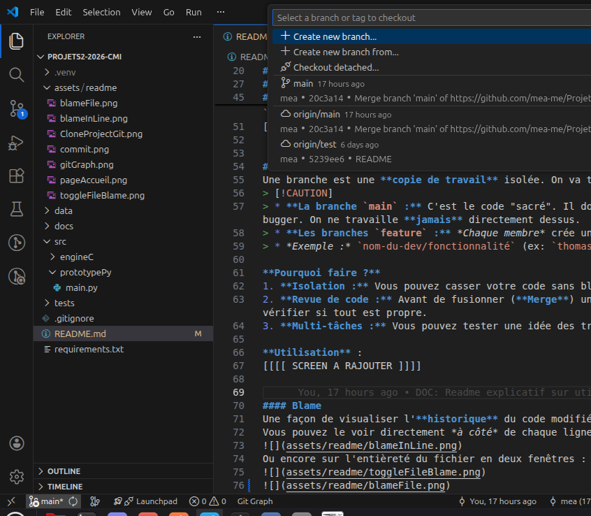
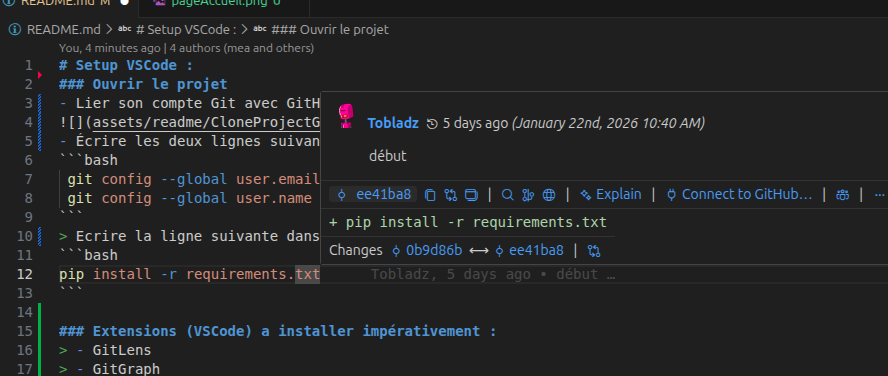
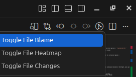
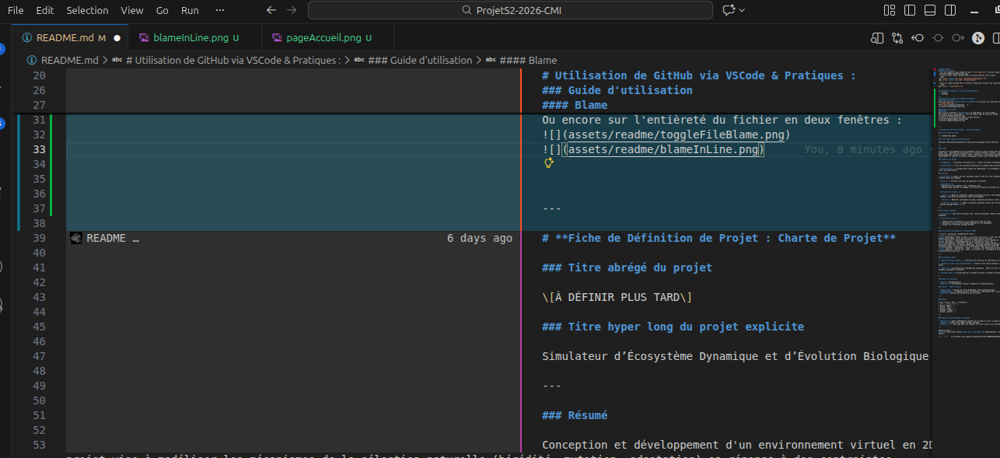
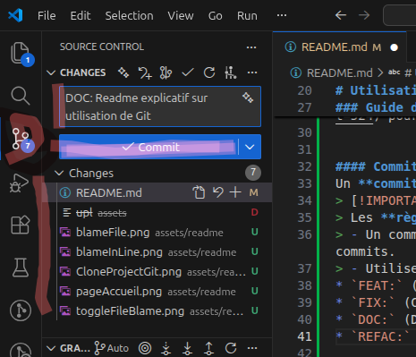
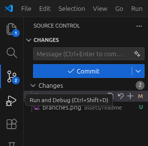
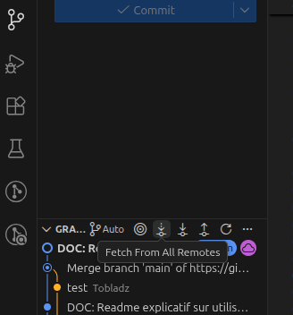
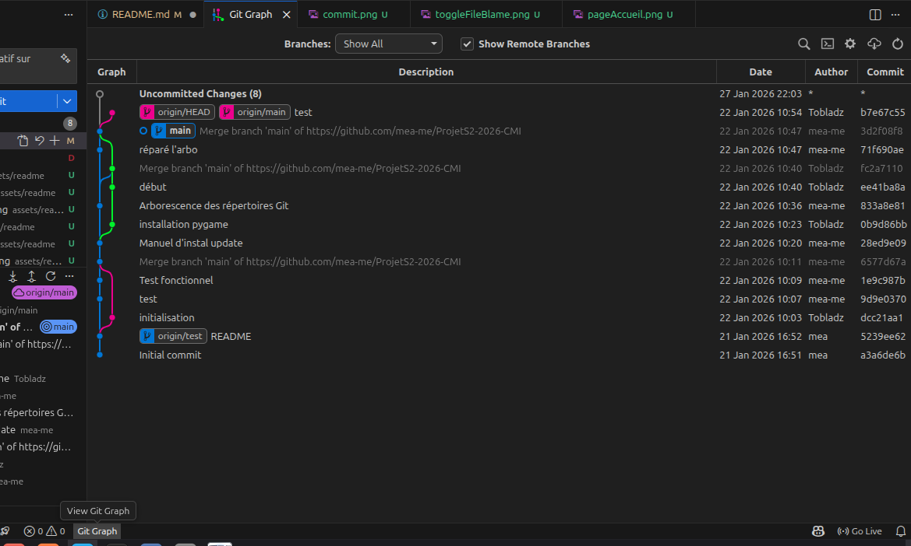

# Setup VSCode :
### Ouvrir le projet 
- Lier son compte Git avec GitHub et faire "`Clone Repository`" de notre repertoire "`ProjetS2-2026-CMI`"

- Écrire les deux lignes suivantes dans le terminal Bash de votre vscode :
```bash
 git config --global user.email "emailDeVotreCompte@gmail.com" 
 git config --global user.name "votreUsernameGit"
```
> Ecrire la ligne suivante dans le terminal vscode pour installer les librairies requises :
```bash
pip install -r requirements.txt
```

### Extensions (VSCode) a installer impérativement :
> - GitLens 
> - GitGraph

---
# Utilisation de GitHub via VSCode & Pratiques :
#### Point de départ :
Vous avez suivi les **instructions précédentes** et avez donc les extensions *GitLens* et *GitGraph*, ainsi que le Git *`ProjetS2-2026-CMI`*. \
Votre écran ressemble normalement à ça :



### Guide d'utilisation
> [!TIP]
> Merci de regarder ces *10 mx: `DOC: mise à jour du readme section branches`
* `REFAC:` (Nettoyage du codeinutes* de [vidéo](https://youtu.be/mJ-qvsxPHpY?si=ETC4dmSehuCjpySC&t=524) pour capter les **bases/grandes idées** de Git & GitHub. 


#### Commit
Un **commit** est une sauvegarde ("snapshot") de votre code à un instant T. \
> [!IMPORTANT]
> Les **règles** :
> - Un commit = **Une** action précise. On évite de mélanger plusieurs domaines, faites **plusieurs** commits.
> - Utilisez des **mots-clés** pour s'y retrouver rapidement :
* `FEAT:` (Nouvelle fonctionnalité)
* `FIX:` (Correction d'un bug)
* `DOC:` (Documentation) -> ex:


#### Blame
Une façon de visualiser l'**historique** du code modifié au fil du temps. \
Vous pouvez le voir directement *à côté* de chaque ligne de code dans VSCode :

Ou encore sur l'entièreté du fichier en deux fenêtres : 

 
 `DOC: mise à jour du readme section branches`
* `REFAC:` (Nettoyage du code) -> ex: `REFAC: renommage variables classe Individu`



#### Pull & Push 
Ces commandes permettent de faire circuler le code entre votre PC et GitHub.
1. **PULL (Récupérer) :** Avant de taffer, faites **toujours** un `Pull`. Cela télécharge les modifications de vos camarades.

2. **PUSH (Envoyer) :** Une fois vos commits *terminés* **et** *testés* **localement**, faites un `Push` pour envoyer votre travail sur GitHub afin que les autres y aient accès.




#### Fetch
Actualiser les pull et push des autres utilisateurs : **indispensables** avant de push :



#### Branches
Une branche est une **copie de travail** isolée. On va travailler en parallèle.
> [!CAUTION]
> * **La branche `main` :** C'est le code "sacré". Il doit **toujours** être fonctionnel et ne jamais bugger. On ne travaille **jamai


#### Blame
Une façon de visualiser l'**historique** du code modifié au fil du temps. \
Vous pouvez le voir directement *à côté* de chaque ligne de code dans VSCode :

Ou encore sur l'entièreté du fichier en deux fenêtres : 

 
s** directement dessus.
> * **Les branches `feature` :** *Chaque membre* crée une branche pour **sa tâche** en cours.
> * *Exemple :* `nom-du-dev/fonctionnalité` (ex: `thomas/moteur-genetique`).

**Pourquoi faire ?**
1. **Isolation :** Vous pouvez casser votre code sans bloquer l'équipe.
2. **Revue de code :** Avant de fusionner (**Merge**) une branche dans `main`, les autres peuvent vérifier si tout est propre.
3. **Multi-tâches :** Vous pouvez tester une idée des trucs foireux et abandonner la branche.

**Utilisation** :


#### Blame
Une façon de visualiser l'**historique** du code modifié au fil du temps. \
Vous pouvez le voir directement *à côté* de chaque ligne de code dans VSCode :

Ou encore sur l'entièreté du fichier en deux fenêtres : 

 


#### Visualiser avec GitGraph
L'extension qui nous permet de voir de façon sympathique ce qui se passe sur le GitHub et y naviguer.


---

### Résumé flux de travail quotidien :
1. `Pull` (Je récupère le travail des autres).
2. `Création de branche` (Si nouvelle tâche).
3. **Travail sur le code.**
4. `Commit` (Je sauvegarde mes étapes avec les mots-clés `FEAT`, `FIX`...).
5. `Push` (Je partage mon travail).
6. `Merge Request` (On fusionne mon travail propre dans la `main` après validation par l'équipe).

---
---

# **Fiche de Définition de Projet : Charte de Projet**

### Titre abrégé du projet

\[À DÉFINIR PLUS TARD\]

### Titre hyper long du projet explicite

Simulateur d’Écosystème Dynamique et d’Évolution Biologique Fictive Numérique

---

### Résumé

Conception et développement d'un environnement virtuel en 2D où évoluent des entités autonomes dotées d'un génome numérique. Le projet vise à modéliser les mécanismes de la sélection naturelle (hérédité, mutation, adaptation) en réponse à des contraintes environnementales variables (biomes, climat, ressources). L'utilisateur interagit avec cet écosystème pour observer l'émergence de comportements et analyser les données biologiques via des outils statistiques intégrés.

### Finalités du projet

- **Pédagogique :** Consolider les acquis de L1 à travers un projet d'envergure.  
    
- **Scientifique :** Créer une simulation simplifiée (et ludique) mais cohérente des principes darwiniens.  
    
- **Bénéficiaires :** L'équipe projet (montée en compétences), les enseignants (évaluation), et potentiellement un public étudiant (outil de démonstration).

### Contexte

- **Historique :** Inspiré par des classiques comme le *Jeu de la Vie* (Conway), mais avec la volonté de le rendre plus profond et réaliste (ainsi que ludique).  
    
- **Utilité :** Création d'un outil de simulation intéressant.  
    
- **Contraintes :**  
  - Deadline de fin de semestre (S2), soutenance orale  
  - Apprentissage simultané du langage C (et volonté de mettre en pratique ces compétences pas encore acquises).


- **Périmètre et limites :**  
    
  - **Inclus :** Moteur de simulation, gestion génétique (allèles), environnement 2D multicouche, interface de contrôle "Godhand / Sandbox", génération de graphiques/ arbres généalogiques.  
      
  - **Exclus :** Rendu 3D, multijoueur en ligne, simulation moléculaire réelle (ATCG).  
      
  - **Limites (théoriques) :** Nombre d'individus simultanés limité par les performances CPU (optimisation voulue/prévue lors d'un possible passage Python \-\> C).

---

### Résultats attendus

- **Livrables :** Code source versionné (Git), Manuel Utilisateur, Manuel Technique, Simulation fonctionnelle avec interface graphique.  
    
- **Critères de succès :**  
    
  1. Stabilité de la simulation sur une longue durée (pas de crash).  
  2. Observation d'une dérive génétique mesurable via les graphiques.  
  3. Fluidité de l'interface (minimum 30 FPS).

---

### Vérification préliminaire \- Objectifs SMART

| Critère | Définition | Argumentation Projet |
| :---- | :---- | :---- |
| **S** (Spécifique) | Cadré et clair | La finalité est précise : créer une simulation ludique (mais précise) d’évolution d’espèces différentes (et en partie aléatoires pour plus de réalisme). |
| **M** (Mesurable) | Indicateurs chiffrés | L’utilisateur aura la possibilité d’afficher des graphes et arbres modélisant les données génétiques et environnementales de la simulation en temps réel. |
| **A** (Atteignable) | Ambitieux / Motivant | Gestion des visuels changeants et modifiables en fonction du génome virtuel, optimisation pour gérer un maximum d’individus, challenge technique du passage Python vers C pour la performance. On peut facilement adapter la difficulté si on estime qu’elle n’est pas au niveau (ex : RapsberryPi). |
| **R** (Réaliste) | Compétences / Temps |  Le groupe a les compétences nécessaires pour réaliser le projet en temps voulu.  |
| **T** (Temporel) | Date de fin | Début : fin janvier Fin : la semaine du 13 avril avec soutenance orale sur notre projet et présentation du projet fini. |

---

### Principaux risques

1. **Risque Technique (Majeur) :** Difficulté de conversion du code Python en C (gestion mémoire complexe).  
     
2. **Risque de Scope Creep (Éparpillement) :** Vouloir faire trop de biomes ou de caractéristiques et ne pas finir le cœur du moteur.  
     
3. **Matériel :** Utilisation de la RaspberryPi compliquée à mettre en œuvre, pas sûr de son utilisation (utilisation très peu probable, uniquement si possible).  
     
4. **Risque Humain :** Déséquilibre de la charge de travail ou manque de coordination sur Git.

---

### Moyens et ressources

- **Sous** : OnEstSansLeSou €.  
- **Matériel :** PC personnels/ Faculté, Raspberry Pi (potentiellement).

### Savoirs à mettre en œuvre

- **Algorithmie :** Gestion de listes dynamiques, arbres phylogénétiques.  
- **Mathématiques :** Probabilités pour les mutations, statistiques pour les graphes.  
- **Système :** Gestion des processus et de la mémoire.

---

### Équipe   

| Nom | Prénom | Rôle (à déterminer) |
| :---- | :---- | :---- |
| Barral | Manon |  |
| Bénard | Mahé |  |
| Bérard | Lucas |  |
| Kelemen | Thomas |  |
| Lebrun | Basile |  |

---

### Règles de fonctionnement de l’équipe	

- **Réunions :** Points hebdomadaires pendant les créneaux du cours ou pauses midi (en présentiel).  
- **Outils :** GitHub, Docs commun, VScode, WhatsApp.  
- **Règle d'or :** Tout code doit être commenté et vérifié avant d'être fusionné.

---

Remarque finale :   
**Si** la fiche projet n’était **pas assez convaincant** ou compréhensible, voici une version rédigée de nos notes (beaucoup plus denses). 

- \-   \- \>    [lien](https://docs.google.com/document/d/1zbl-GMkQ7b7JMycH44RzKTMs6kIJbSqLNc5aoA7faTA/edit?usp=sharing)

---

DOCS : \-   \- \>    [lien](https://docs.google.com/document/d/16k68Vo-HPmEy6mESIkwwFkaxOUr6pk0l6-nkWMPSHuM/edit?usp=sharing)